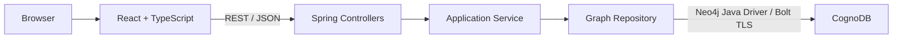
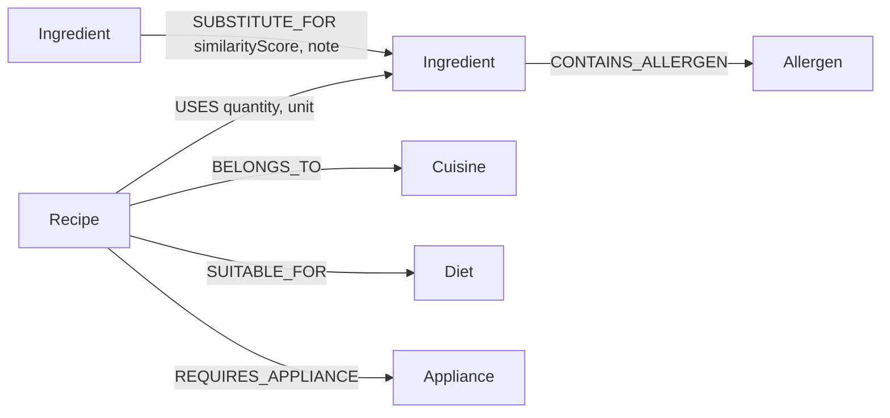
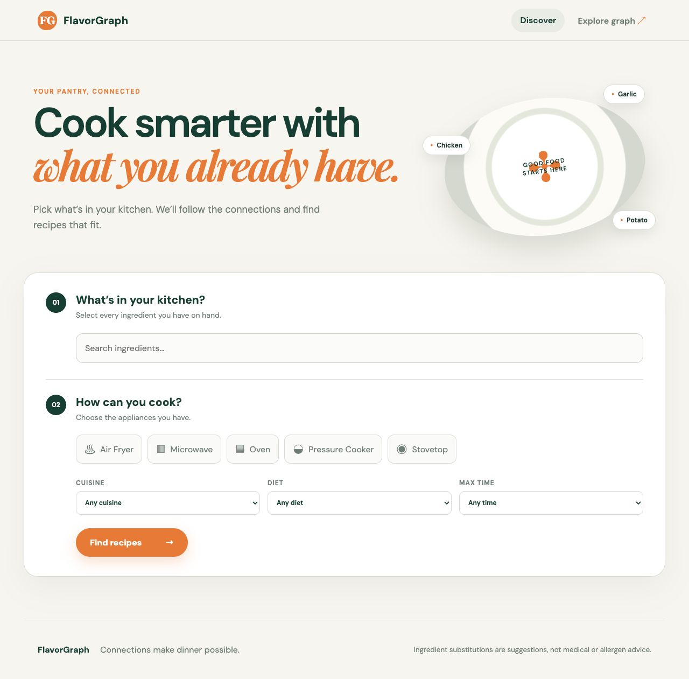
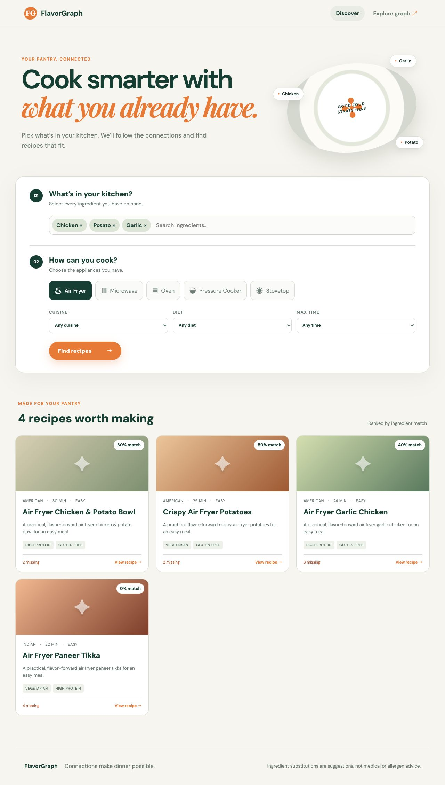
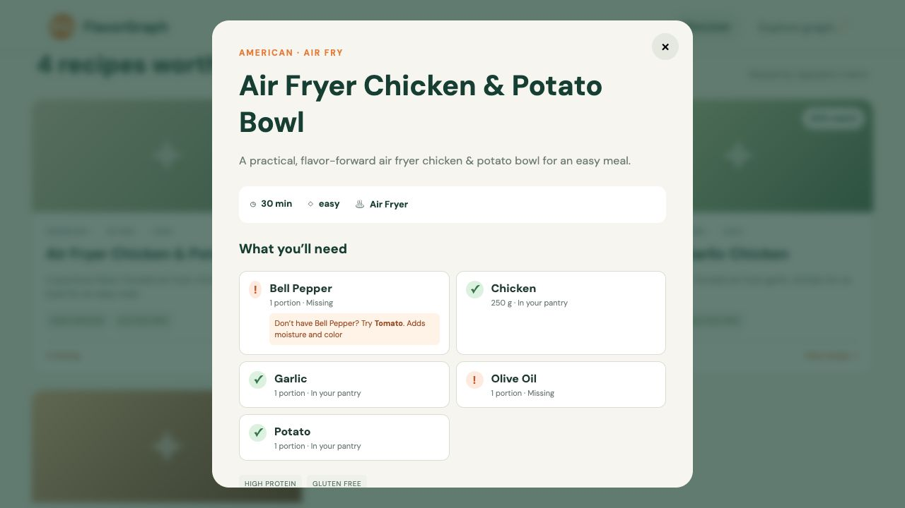
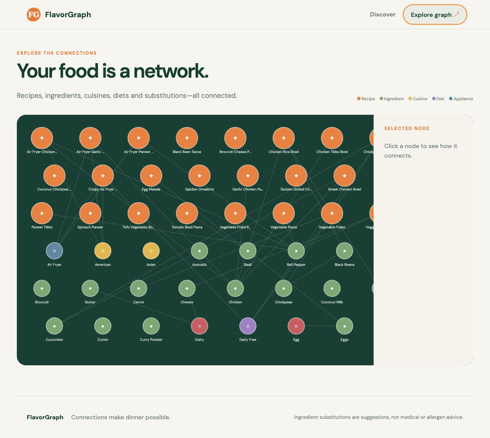

# FlavorGraph

**Cook smarter with what you already have.** FlavorGraph is a consumer recipe finder that ranks meals against a pantry, filters by kitchen equipment and preferences, follows ingredient relationships to suggest practical substitutes, and provides ordered cooking instructions for every recipe.

## Demo

- Live Demo: https://flavorgraph-ten.vercel.app/


## What problem does FlavorGraph solve?

Choosing dinner is often a relationship problem: a recipe needs several ingredients and an appliance; a person owns only some of them; and one owned ingredient may replace a missing one. FlavorGraph turns those connections into ranked, understandable suggestions instead of asking someone to browse a static recipe catalog.

### End-to-end user journey

1. Search for and select pantry ingredients.
2. Select available appliances and optional cuisine, diet, and time filters.
3. Receive eligible recipes ranked by direct ingredient overlap and substitution paths.
4. Open a recipe to see quantities, owned and missing ingredients, substitute suggestions, and ordered cooking steps.
5. Explore Recipe, Ingredient, Cuisine, Diet, Appliance, Allergen, and substitution relationships visually.

## Why a graph database?

Relationships are first-class data here: recipes use ingredients, belong to cuisines, suit diets, require appliances, and ingredients substitute for one another or carry allergen associations. The useful question is frequently a path—not a row lookup. For example, `owned ingredient → substitute for → missing ingredient ← used by ← recipe` can reveal a meal that looks impossible from direct overlap alone.

A relational implementation is possible, but requires several entity and join tables plus a multi-join query whose intent is less direct. A graph is not universally better: transactional tabular reporting and highly regular aggregates may favor SQL. CognoDB fits this relationship-heavy discovery use case and lets the application express traversals directly.

## Architecture



The shared official driver manages connections. Controllers validate and shape HTTP requests, the service owns the application boundary, and the repository maps parameterized Cypher results into DTOs; raw driver objects never cross the API.

### Project structure

```text
flavorgraph/
├── backend/
│   ├── src/main/java/com/flavorgraph/backend/
│   │   ├── config/       # Driver and CORS configuration
│   │   ├── controller/   # REST endpoints
│   │   ├── dto/          # Stable HTTP response/request shapes
│   │   ├── exception/    # Safe global error mapping
│   │   ├── repository/   # Static, parameterized Cypher
│   │   └── service/      # Application logic and idempotent seed runner
│   └── src/test/         # Unit and application-context tests
├── frontend/src/
│   ├── api/              # Typed HTTP client
│   ├── types/            # Frontend domain types
│   └── App.tsx           # Discovery, details, and graph explorer UI
├── docs/screenshots/     # Reviewer-facing UI captures
└── render.yaml           # Render backend blueprint
```

## Graph data model



`quantity` and `unit` live on `USES` because 200 g of chicken describes chicken's role in one recipe, not chicken itself. `cookingMethod` is a scalar recipe characteristic; `Appliance` is a node because it is a shared, filterable entity with many recipe relationships. Allergen data and substitutions are demo suggestions, not medical advice.

## Important queries

Every value is passed as a Cypher parameter. Where labels differ, the code selects between complete static query constants; Cypher is never assembled with string concatenation.

### 1. Ingredient overlap ranking

```cypher
MATCH (r:Recipe)-[:USES]->(i:Ingredient)
WITH r, collect(DISTINCT i) AS ingredients
WITH r, ingredients, [i IN ingredients WHERE i.id IN $ingredientIds] AS matched
RETURN r, size(matched), size(ingredients)
ORDER BY toFloat(size(matched)) / size(ingredients) DESC
```

The repository expands this with cuisine, diet, appliance and time filters and uses stable secondary sorting.

### 2. Recipe details and relationship properties

```cypher
MATCH (r:Recipe {id: $id})-[u:USES]->(i:Ingredient)
RETURN r, i, u.quantity, u.unit
```

This returns recipe-specific ingredient amounts without duplicating ingredient nodes.

### 3. Relationship-based filters

```cypher
MATCH (r)-[:BELONGS_TO]->(c:Cuisine)
OPTIONAL MATCH (r)-[:SUITABLE_FOR]->(d:Diet)
OPTIONAL MATCH (r)-[:REQUIRES_APPLIANCE]->(a:Appliance)
WHERE ($cuisineId = '' OR c.id = $cuisineId)
```

Diet and appliance filters apply to related nodes, not flattened strings.

### 4. Multi-hop substitution traversal

```cypher
MATCH (r:Recipe {id: $id})-[:USES]->(missing:Ingredient)
OPTIONAL MATCH (alternative:Ingredient)-[s:SUBSTITUTE_FOR]->(missing)
RETURN missing, alternative, s.similarityScore, s.note
```

This explicit two-hop path is `Recipe → Ingredient ← Substitute`.

### 5. Graph-native recipe rescue

```cypher
MATCH (r:Recipe)-[:USES]->(needed:Ingredient)
MATCH (owned:Ingredient)-[:SUBSTITUTE_FOR]->(needed)
WHERE owned.id IN $ingredientIds
RETURN r, collect(DISTINCT needed)
```

The search query combines this path with every missing recipe ingredient and marks a recipe `possibleWithSubstitutions` when owned substitutes cover the missing set. In SQL this needs recipe-ingredient, substitution and pantry joins plus grouping/count comparison.

## Tech stack

- React 19, TypeScript, Vite, responsive CSS and an interactive bounded SVG explorer
- Java 21, Spring Boot 4.1, Spring Web MVC, Bean Validation, Maven
- Official Neo4j Java Driver 6 over Bolt TLS to CognoDB
- Vercel-ready frontend and independently deployable Spring Boot JAR

## Local setup

Requirements: Java 21, Node.js 20+, and a CognoDB instance. From the repository root, copy the examples; never commit real values:

```bash
cp .env.example .env.local
cp frontend/.env.example frontend/.env.local
```

### Environment variables

Backend: `COGNODB_URI`, `COGNODB_USERNAME`, `COGNODB_PASSWORD`, `FRONTEND_URL`, and optional `SEED_DATABASE`. Frontend: `VITE_API_BASE_URL` only. Database credentials must never use the `VITE_` prefix.

### CognoDB setup and seed database

1. Create an account at [console.cognodb.com/signup](https://console.cognodb.com/signup).
2. Create a free `c0` instance and choose a nearby region. The assignment notes that the free tier allows one instance per workspace.
3. Save the generated password immediately; CognoDB displays it only once. Copy the `bolt+s://...` URI, username `cognodb`, and password into the root `.env.local`.
4. Keep credentials only in environment variables. The frontend never receives them.
5. Load the variables and run the idempotent seed once:

```bash
set -a
source .env.local
set +a
cd backend
SEED_DATABASE=true ./mvnw spring-boot:run
```

Wait for `FlavorGraph demo data seeded idempotently`, then stop the process with `Ctrl+C`. The seed runner uses `MERGE`, stable IDs, and relationship merges. It creates 24 recipes with ordered instructions, 40+ ingredients, six cuisines, four diets, five appliances, allergens and 12 substitutions. Reruns update FlavorGraph records without duplicating them and do not delete unrelated database content. Constraints are attempted individually and treated as optional for CognoDB syntax compatibility. The dataset is intentionally small for CognoDB's free-tier resource limits.

### Run backend

```bash
set -a
source .env.local
set +a
cd backend
./mvnw spring-boot:run
```

Verify `http://localhost:8080/api/health` and `http://localhost:8080/api/health/database` before starting the frontend.

### Run frontend

```bash
cd frontend
npm install
npm run dev
```

Open `http://localhost:5173`. The API defaults to `http://localhost:8080`.

### Fresh-clone quick start

Use two terminals after creating both `.env.local` files:

```bash
# Terminal 1, repository root
set -a; source .env.local; set +a
cd backend && ./mvnw spring-boot:run
```

```bash
# Terminal 2, repository root
cd frontend && npm install && npm run dev
```

## API

`GET /api/health`, `GET /api/health/database`, catalog endpoints at `/api/ingredients`, `/api/cuisines`, `/api/diets`, `/api/appliances`, `POST /api/recipes/search`, `GET /api/recipes/{id}`, `POST /api/recipes/{id}/availability`, and `GET /api/graph`.

Database failures are mapped to HTTP 503 with a safe `DATABASE_UNAVAILABLE` response. Validation is 400, missing recipes are 404, and unexpected failures are 500; stack traces and credentials are not sent to clients.

## Testing

```bash
cd backend && ./mvnw test && ./mvnw package
cd ../frontend && npm run lint && npm run build
```

Unit tests cover service delegation/business boundaries, DTO normalization, the health contract, safe database error mapping, and application wiring. They do not require production CognoDB.


## Screenshots

### Discover



### Ranked recipe results



### Availability and graph-powered substitution



### Graph explorer


